# thresh Roadmap 2026 - Distributed Development Orchestration

**Created**: February 6, 2026  
**Timeline**: 16 weeks (4 months)  
**Goal**: Transform thresh from local WSL manager to distributed dev environment orchestrator

---

## 🎯 Vision

**Current State (v1.0):**
```
Single Windows machine → WSL environments → OpenAI/Copilot blueprints
```

**Target State (v2.0):**
```
Fleet of machines → Mesh network → Central orchestration → Cross-platform (WSL/containerd) → MCP integration
```

---

## 📊 Feature Evaluation

### Already Implemented ✅

| Feature | Status | Binary Size | Value |
|---------|--------|-------------|-------|
| Dual AI Providers | ✅ Complete | 16.6 MB | High |
| WSL Integration | ✅ Complete | (included) | High |
| Blueprint System | ✅ Complete | (included) | High |
| GitHub Actions (Windows) | ✅ Complete | N/A | Medium |
| MCP Server | ✅ Complete | ~100 KB | High |

### Proposed Features 🔮

| Feature | Effort | Size Impact | Value | Priority |
|---------|--------|-------------|-------|----------|
| **Cross-Platform (containerd)** | 2 weeks | +200 KB | 🔥 Huge | **P0** |
| **MCP Server Completion** | 1-2 weeks | +100 KB | 🔥 Huge | **P0** |
| **Host Metrics** | 1 week | +80 KB | High | **P1** |
| **Agent Mode** | 1 week | +60 KB | High | **P1** |
| **Mesh Network (Dual)** | 2 weeks | +120 KB | High | **P1** |
| **Central Hub** | 2 weeks | Separate | High | **P2** |
| **Workload Orchestration** | 2 weeks | +100 KB | Very High | **P2** |
| **Multi-Platform CI/CD** | 1 week | N/A | Medium | **P2** |

**Total Binary Growth:** 16.6 MB → **17.3 MB** (4% increase for 8x functionality)

---

## 🗺️ Phased Implementation Plan

### **Phase 1: Foundation (Weeks 1-4) - Cross-Platform Core**

**Goal:** Make thresh work everywhere with MCP integration

#### Week 1-2: Container Runtime Abstraction
- [x] Create `IContainerService` interface
- [x] Refactor `WslService` to implement interface
- [x] Create `ContainerdService` for Linux/macOS
- [x] Platform detection and factory
- [x] Test on Windows (WSL) + Linux (containerd) + macOS (containerd)

**Deliverables:**
```bash
# Works on any platform
thresh up python-dev  # Uses WSL on Windows, containerd elsewhere
thresh list
thresh destroy python-dev
```

**Binary:** 16.6 MB → 16.8 MB (+200 KB)

#### Week 3-4: MCP Server Completion
- [x] Complete MCP protocol implementation
- [x] Expose all thresh commands via MCP
- [x] Add input schemas for all tools
- [x] Add stdio transport for AI editors
- [x] Test with VS Code Copilot (manual testing ready)

**Deliverables:**
```bash
# MCP server mode
thresh mcp start --stdio
thresh mcp start --socket /tmp/thresh.sock

# VS Code can now call thresh operations
```

**Binary:** 16.8 MB → 16.9 MB (+100 KB)

**Phase 1 Success Metrics:**
- ✅ thresh runs on Windows, Linux, macOS
- ✅ Single binary works across platforms
- ✅ MCP server functional in VS Code
- ✅ AI editors can provision environments

---

### **Phase 2: Metrics & Networking (Weeks 5-8) - Distributed Foundation**

**Goal:** Enable multi-machine awareness and connectivity

#### Week 5: Host Metrics Collection
- [ ] Create `HostMetrics` model
- [ ] Implement cross-platform metrics (CPU, RAM, storage)
- [ ] Add `thresh metrics` command
- [ ] JSON output for scripting

**Deliverables:**
```bash
thresh metrics
thresh metrics --json

# Output:
{
  "hostname": "dev-machine-01",
  "platform": "windows",
  "cpu_percent": 23.5,
  "memory_used_gb": 8.2,
  "memory_total_gb": 16.0,
  "storage_free_gb": 150.0,
  "containers": 3
}
```

**Binary:** 16.9 MB → 17.0 MB (+80 KB)

#### Week 6: Agent Mode
- [ ] Implement daemon/background mode
- [ ] Periodic metrics collection
- [ ] HTTP reporting client
- [ ] Configuration for hub URL

**Deliverables:**
```bash
thresh agent start
thresh agent status
thresh agent stop

# Runs in background, reports metrics every 60s
```

**Binary:** 17.0 MB → 17.06 MB (+60 KB)

#### Week 7-8: Dual Mesh Network Support
- [ ] Create `IMeshNetworkService` interface
- [ ] Implement `TailscaleService`
- [ ] Implement `NetmakerService`
- [ ] Add `thresh network` commands
- [ ] Test air-gapped (Netmaker) and cloud (Tailscale)

**Deliverables:**
```bash
# Tailscale (simple)
thresh network join --provider tailscale
thresh network status

# Netmaker (air-gapped)
thresh network join --provider netmaker \
  --server https://netmaker.local \
  --token <token>

thresh network peers
```

**Binary:** 17.06 MB → 17.18 MB (+120 KB)

**Phase 2 Success Metrics:**
- ✅ Agents report metrics to hub
- ✅ Mesh network connectivity (Tailscale + Netmaker)
- ✅ Multi-node communication working
- ✅ Air-gapped deployment tested

---

### **Phase 3: Orchestration (Weeks 9-12) - Fleet Management**

**Goal:** Central hub with workload scheduling

#### Week 9-10: Central Hub (Separate Project)
- [ ] Create `thresh-hub` ASP.NET Core project
- [ ] Metrics ingestion API (`POST /api/v1/agents/{id}/metrics`)
- [ ] Agent registry and status
- [ ] SQLite persistence
- [ ] Simple web dashboard

**Deliverables:**
```bash
# Deploy hub
thresh-hub start --bind 10.10.1.1:8080

# Agents automatically report
thresh agent start --hub http://10.10.1.1:8080
```

**Hub Binary:** ~8-10 MB (separate from thresh)

#### Week 11-12: Workload Orchestration
- [ ] Workload placement algorithm
- [ ] Remote provisioning API
- [ ] Hub → Agent RPC communication
- [ ] Status tracking and reporting

**Deliverables:**
```bash
# From any machine, provision anywhere
thresh up python-dev --remote --cpu-min 4 --memory-min 8gb

# Output:
✓ Analyzing fleet capacity...
✓ Selected host: dev-server-03 (CPU: 15%, RAM: 4/64GB)
✓ Provisioning on 10.10.1.5...
✓ Environment ready: ssh 10.10.1.5 -t "wsl -d python-dev"
```

**Binary:** 17.18 MB → 17.28 MB (+100 KB)

**Phase 3 Success Metrics:**
- ✅ Hub aggregates metrics from 3+ agents
- ✅ Remote workload provisioning works
- ✅ Automatic host selection based on resources
- ✅ Dashboard shows fleet status

---

### **Phase 4: Polish & Distribution (Weeks 13-16) - Production Ready**

**Goal:** Production-grade quality and distribution

#### Week 13: Multi-Platform CI/CD
- [ ] Add Linux x64 build to GitHub Actions
- [ ] Add macOS ARM64 build
- [ ] Update release workflow for 3 platforms
- [ ] Add build badges to README

**Deliverables:**
- Linux binary (13-15 MB)
- macOS binary (14-16 MB)
- Windows binary (17.3 MB)

#### Week 14: Package Managers
- [ ] Update Chocolatey (Windows)
- [ ] Update Scoop (Windows)
- [ ] Update Winget (Windows)
- [ ] Create Homebrew formula (macOS)
- [ ] Create APT/RPM packages (Linux)

**Deliverables:**
```bash
# Windows
choco install thresh
scoop install thresh
winget install thresh

# macOS
brew install thresh

# Linux
apt install thresh       # Debian/Ubuntu
yum install thresh       # RHEL/Fedora
```

#### Week 15: Documentation & Examples
- [ ] Complete getting started guide
- [ ] Architecture documentation
- [ ] MCP integration examples
- [ ] Fleet deployment guide
- [ ] Video demos

#### Week 16: Testing & Hardening
- [ ] End-to-end testing (all platforms)
- [ ] Security audit
- [ ] Performance optimization
- [ ] Bug fixes
- [ ] Release v2.0

**Phase 4 Success Metrics:**
- ✅ All platforms build automatically
- ✅ Package managers updated
- ✅ Comprehensive documentation
- ✅ Production deployments validated

---

## 🏗️ Architecture Evolution

### v1.0 (Current)
```
┌─────────────────┐
│  thresh.exe     │
│  (Windows)      │
│                 │
│  ├─ WSL         │
│  ├─ OpenAI      │
│  └─ Copilot SDK │
└─────────────────┘
```

### v2.0 (Target - Week 16)
```
                    ┌──────────────────┐
                    │   thresh-hub     │
                    │  (API + Dashboard)│
                    └────────┬─────────┘
                             │
              Mesh Network (Tailscale/Netmaker)
                             │
          ┌──────────────────┼──────────────────┐
          │                  │                  │
    ┌─────▼─────┐      ┌─────▼─────┐     ┌─────▼─────┐
    │  thresh   │      │  thresh   │     │  thresh   │
    │ (Windows) │      │  (Linux)  │     │  (macOS)  │
    │           │      │           │     │           │
    │ • WSL     │      │•containerd│     │•containerd│
    │ • Agent   │      │ • Agent   │     │ • Agent   │
    │ • Metrics │      │ • Metrics │     │ • Metrics │
    │ • MCP     │      │ • MCP     │     │ • MCP     │
    └───────────┘      └───────────┘     └───────────┘
         ▲                  ▲                  ▲
         │                  │                  │
    VS Code           VS Code           VS Code
    (via MCP)        (via MCP)         (via MCP)
```

---

## 📦 Binary Size Progression

| Milestone | Size | Growth | Features |
|-----------|------|--------|----------|
| v1.0 (current) | 16.6 MB | - | WSL, Dual AI |
| + Cross-platform | 16.8 MB | +200 KB | containerd support |
| + MCP | 16.9 MB | +100 KB | MCP server |
| + Metrics | 17.0 MB | +80 KB | Host monitoring |
| + Agent | 17.06 MB | +60 KB | Background mode |
| + Mesh | 17.18 MB | +120 KB | Tailscale + Netmaker |
| + Orchestration | 17.28 MB | +100 KB | Remote provisioning |
| **v2.0 (final)** | **17.3 MB** | **+4.2%** | **8x functionality** |

**Exceptional efficiency:** <1 MB growth for fleet orchestration capabilities

---

## 🎯 Success Criteria

### Technical Metrics
- [ ] Single binary runs on Windows, Linux, macOS
- [ ] Binary size < 20 MB
- [ ] Provision time < 30 seconds
- [ ] Fleet of 10+ nodes managed seamlessly
- [ ] MCP integration working in 3+ AI editors
- [ ] Mesh network latency < 100ms
- [ ] Hub handles 100+ agents

### User Experience
- [ ] Install to first environment: < 5 minutes
- [ ] Fleet setup: < 30 minutes
- [ ] Zero configuration auto-discovery
- [ ] One-command remote provisioning
- [ ] Comprehensive documentation

### Distribution
- [ ] Available in 6+ package managers
- [ ] Automated releases on tag
- [ ] All platforms build in < 10 minutes
- [ ] SBOM generation automated

---

## 🚀 Quick Start (v2.0 Vision)

### Local Developer (Week 4)
```bash
# Install
brew install thresh  # or winget, apt, etc.

# Use locally
thresh up python-dev
thresh chat
```

### Small Team (Week 8)
```bash
# Each dev joins Tailscale mesh
thresh network join --provider tailscale
thresh agent start

# Anyone can provision anywhere
thresh up node-dev --remote
```

### Enterprise Fleet (Week 12)
```bash
# IT deploys infrastructure
docker run -d thresh-hub
docker run -d netmaker

# Devs join air-gapped network
thresh network join --provider netmaker \
  --server http://netmaker.corp

# Hub orchestrates workloads
thresh up python-dev --remote --priority high
```

---

## 🔄 Dependencies Between Features

```mermaid
graph TD
    A[Dual AI ✅] --> B[MCP Server]
    C[WSL Service ✅] --> D[Container Abstraction]
    D --> E[Cross-Platform]
    E --> F[Multi-Platform Builds]
    
    E --> G[Host Metrics]
    G --> H[Agent Mode]
    H --> I[Mesh Network]
    I --> J[Central Hub]
    J --> K[Workload Orchestration]
    
    B --> L[AI Editor Integration]
    K --> M[Fleet Management]
    
    style A fill:#90EE90
    style C fill:#90EE90
    style B fill:#FFD700
    style D fill:#FFD700
    style E fill:#FFD700
    style F fill:#FFD700
    style G fill:#87CEEB
    style H fill:#87CEEB
    style I fill:#87CEEB
    style J fill:#FFA07A
    style K fill:#FFA07A
```



**Legend:**
- 🟢 Green: Complete
- 🟡 Yellow: Phase 1 (Weeks 1-4)
- 🔵 Blue: Phase 2 (Weeks 5-8)
- 🟠 Orange: Phase 3 (Weeks 9-12)

---

## 💰 Cost-Benefit Analysis

### Development Investment
- **Time:** 16 weeks (1 developer)
- **Complexity:** Medium (leverages existing patterns)
- **Risk:** Low (incremental, tested at each phase)

### Value Delivered

**For Individual Developers:**
- ✅ Works on any platform (not just Windows)
- ✅ AI editor integration (MCP)
- ✅ Faster than Docker for dev environments

**For Small Teams (2-10 devs):**
- ✅ Shared infrastructure (Tailscale mesh)
- ✅ Auto-discovery, zero config
- ✅ Cost: Free (Tailscale free tier)

**For Enterprises (100+ devs):**
- ✅ Air-gapped deployment (Netmaker)
- ✅ Central fleet management
- ✅ Resource optimization (50% better utilization)
- ✅ Compliance friendly (on-prem)

**ROI Estimate:**
- 10 developers × 30 min/day saved = 25 hours/week
- At $100/hour = **$2,500/week saved**
- 16 weeks development = **Pays for itself in 2 months**

---

## 🎓 Learning & Skill Development

**Technologies mastered during implementation:**
- ✅ Cross-platform .NET Native AOT
- ✅ Container runtime integration
- ✅ MCP (Model Context Protocol)
- ✅ Mesh networking (WireGuard)
- ✅ Distributed systems
- ✅ gRPC/HTTP APIs
- ✅ Workload scheduling algorithms

**Valuable for:**
- Platform engineering roles
- DevOps automation
- Distributed systems architecture
- Developer tooling

---

## 🔮 Future Enhancements (Post v2.0)

### v2.1 - Advanced Features
- [ ] GPU workload scheduling
- [ ] Kubernetes integration
- [ ] VS Code extension (dedicated)
- [ ] Web UI for hub

### v2.2 - Enterprise Features
- [ ] RBAC (Role-Based Access Control)
- [ ] Audit logging
- [ ] SSO integration
- [ ] Multi-tenancy

### v3.0 - Platform
- [ ] thresh marketplace (blueprint sharing)
- [ ] Plugin system
- [ ] Terraform provider
- [ ] Pulumi provider

---

## ✅ Recommendation: Proceed with Full Plan

**Why this plan works:**

1. **Incremental:** Each phase delivers value independently
2. **Low risk:** Build on proven patterns (dual AI provider model)
3. **High impact:** 8x functionality for 4% size increase
4. **Market timing:** MCP adoption is accelerating (2026)
5. **Competitive moat:** No tool does WSL + containerd + MCP + fleet management

**What makes it unique:**
- Only tool bridging WSL and containers
- Only dev environment tool with MCP support
- Only orchestrator designed for air-gapped
- Smallest binary in category (17 MB vs competitors at 50-100 MB)

**Next steps:**
1. ✅ Approve roadmap
2. Create feature branches
3. Start Phase 1, Week 1 (container abstraction)
4. Ship incremental releases every 4 weeks

---

**Decision Point:** Proceed with 16-week plan to v2.0?
